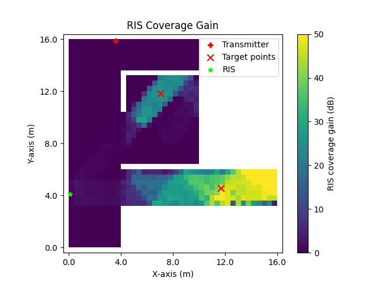
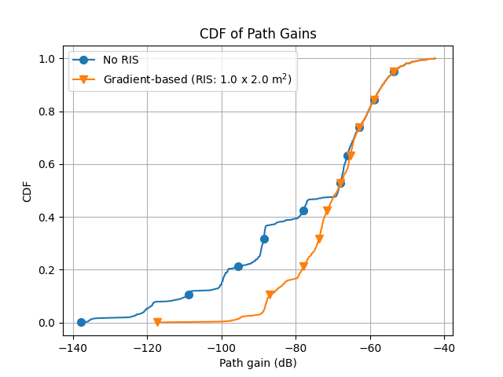

Computing combined coverage map with custom RIS parameter specifications
########################################################################

This tutorial explains how to compute a combined coverage map, taking into account the contributions of both the transmitter and the placed RIS.

.. note::

   Before executing this step, you must first compute and visualize the **transmitter-only coverage map**.  
   Please follow the `Computing Transmitter-Only Coverage Map` tutorial beforehand.

1. **Define RIS Target Points**

   There are two ways to define the RIS target points:

   - **Using the Target Points from Clustering**:

      .. note::

         To use this option, you must first run the clustering algorithm to compute target points.  
         Refer to the `Finding RIS Target Points via K-means Clustering` tutorial before proceeding.

      In the GUI, select the radio button **"Use the target point(s) found via clustering algorithm"**.

   - **Manually Entering Target Point Coordinates**:

      - Go to the labelframe **"Manual trials"** on the left side of the GUI.
      - Enter the number of RIS target points in the field **"Number of target points"**
      - Select the checkbox **"Enter the target point(s) manually"**.
      - A new input area will appear at the bottom of the same labelframe.
      - Enter the x, y, z coordinates for each target point manually.

2. **Enter RIS Parameters**

   - Set the RIS center position under the labelframe **"Enter RIS center position (m) (x,y,z)"**.
   - Set the RIS height and width under **"RIS height (m)"** and **"RIS width (m)"**, respectively.

   .. note::

      To determine feasible RIS positions in the scene, refer to the `Computing Feasible RIS Positions` tutorial.

3. **Choose Phase Profile Approach**

   - Select the desired phase profile approach from the dropdown next to the textlabel **"Choose phase profile approach"**.
   - If **"Manual entry"** is selected:

      - A new menu  appears at the bottom of the GUI under the labelframe **"Select manual phase profile file (.json)"**.
      - Click the **"Browse"** button to select the phase profile `.json` file.

4. **Computing combined coverage map**

   - Press the button **"Compute combined coverage map (TX + RIS)"**.
   - After execution:

      - **Combined coverage map** with the contributions of the transmitter and the RIS (Fig. 1).
      - **RIS coverage gain map** showing the power improvement due to RIS (Fig. 2).
      - **Cumulative distribution function (CDF)** plot comparing the no-RIS case and all previous combined coverage cases (Fig. 3).
      - **New binary poor coverage map** after placing the RIS (Fig. 4).

   Additionally, the values for the new coverage ratio of the combined coverage map and the new average power of the low-power cells will be displayed under the labelframe **"Messages"**.  
   If the operation ends without errors, the message **"Combined coverage is analyzed successfully!"** will appear.

An example scenario consisting of two RIS target points is shown below:

   **Fig. 1**: Combined coverage map with the contributions of the transmitter and the RIS

   **Fig. 2**: RIS coverage gain map

   **Fig. 3**: Cumulative distribution function (CDF)

.. figure:: computing_combined_coverage_Fig4.png
   :align: center
   :figwidth: 80%
   :name: computing_combined_coverage_Fig4

   **Fig. 4**: New binary poor coverage map after placing the RIS
