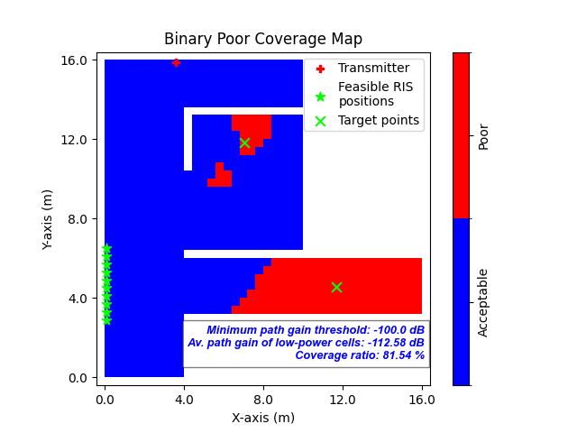

Computing Feasible RIS Positions
################################

This section explains how to determine the feasible RIS positions based on the location of the transmitter and the RIS target point(s).

.. note::

   Before executing this step, you must first compute and visualize the **transmitter-only coverage map**.  
   Please follow the `Computing Transmitter-Only Coverage Map` tutorial beforehand.

There are two ways to determine the feasible RIS positions:

1. **Using the Target Points from Clustering**

.. note::

   To use this option, you must first run the clustering algorithm to compute target points.  
   Refer to the `Finding RIS Target Points via K-means Clustering` tutorial before proceeding.

In the GUI, select the radio button **"Use the target point(s) found via clustering algorithm"**. This will use the previously computed RIS target points to determine feasible RIS positions.

2. **Manually Entering Target Point Coordinates**

- Go to the labelframe **"Manual trials"** on the left side of the GUI.
- In the field **"Number of target points"**, enter how many target points you want to specify.
- Select the checkbox **"Enter the target point(s) manually"**.
- A new input area will appear at the bottom of the same labelframe.
- Enter the **x, y, z coordinates** for each target point manually.

Final Step: **Compute Feasible RIS Positions**

- After selecting or entering the target points, press the button **"Compute feasible RIS positions"**.
- This will compute all feasible RIS positions that have **line-of-sight (LoS)** to both the transmitter and all RIS target points.
- After execution:

  - A **binary poor coverage map** is displayed.

  - Target points are shown as **green 'X' symbols**.

  - Feasible RIS positions are marked with **green star symbols**.

   **Fig. 1**: Binary poor coverage map showing RIS target points (green 'X') and feasible RIS positions (green stars)
