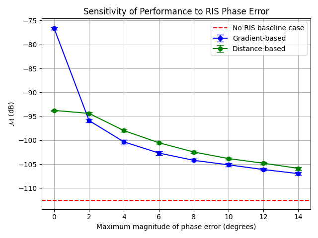

Phase Error Performance Sensitivity Analysis
############################################

This tutorial explains how to analyze the sensitivity of performance when phase errors are introduced to the RIS elements within a specified delta range.

Simulation Procedure
====================

In this analysis, the following steps are followed:

1. **Ideal Phase Profile Calculation**:  
   The ideal phase profile for the RIS is computed for a given target configuration using the selected phase profile approach (e.g., Gradient-based, distance-based, or manual entry).

2. **Introduction of Phase Errors**:  
   A uniform random phase error is added independently to each RIS element. The error for each element is sampled from a uniform distribution within :math:`[-\Delta, +\Delta]` radians:

   .. math::

      \epsilon_{n,m} \sim \mathcal{U}(-\Delta, +\Delta)

   where :math:`\epsilon_{n,m}` is the random phase error introduced to the :math:`(n,m)`-th RIS element, and :math:`\Delta` is the maximum magnitude of the error (in radians, user-specified in degrees).

   The resulting phase profile after introducing phase errors becomes:

   .. math::

      \varphi_{n,m}^{\text{with error}} = \varphi_{n,m}^{\text{ideal}} + \epsilon_{n,m}

   where :math:`\varphi_{n,m}^{\text{ideal}}` denotes the original (ideal) phase value.

3. **Coverage Map Computation**:  
   Using the phase profile with errors, the coverage map is computed via a ray-tracing simulation.

4. **Performance Metric Evaluation**:  
   The performance metric is evaluated as the average received power over the predefined low-power cells.

5. **Monte Carlo Averaging**:  
   Multiple realizations (random draws of phase errors) are performed for each delta value, and the average and standard deviation of the performance metric are computed across these realizations to obtain a statistically meaningful performance degradation curve.

6. **Visualization**:  
   The average performance metric is plotted against the maximum phase error :math:`\Delta` (in degrees), with error bars showing the standard deviation across realizations.

How to Perform Phase Error Sensitivity Analysis in the GUI
==========================================================

.. note::

   Before executing this step, you must first compute and visualize the **transmitter-only coverage map**.  
   Please follow the `Computing Transmitter-Only Coverage Map` tutorial beforehand.

1. **Define RIS Target Points**

   There are two ways to define the RIS target points:

   - **Using the Target Points from Clustering**:

      .. note::

         To use this option, you must first run the clustering algorithm to compute target points.  
         Refer to the `Finding RIS Target Points via K-means Clustering` tutorial before proceeding.

      In the GUI, select the radio button **"Use the target point(s) found via clustering algorithm"**.

   - **Manually Entering Target Point Coordinates**:

      - Go to the labelframe **"Manual trials"** on the left side of the GUI.
      - Enter the number of RIS target points in the field **"Number of target points"**
      - Select the checkbox **"Enter the target point(s) manually"**.
      - A new input area will appear at the bottom of the same labelframe.
      - Enter the x, y, z coordinates for each target point manually.

2. **Enter RIS Parameters**

   - Set the RIS center position under the labelframe **"Enter RIS center position (m) (x,y,z)"**.
   - Set the RIS height and width under **"RIS height (m)"** and **"RIS width (m)"**, respectively.

   .. note::

      To determine feasible RIS positions in the scene, refer to the `Computing Feasible RIS Positions` tutorial.

3. **Conduct Sensitivity Analysis**

   - Under the labelframe **"Sensitivity analysis"**, enter the minimum, maximum, and step values of :math:`\Delta` (in degrees) to define the maximum phase error.
   - Specify the number of realizations to consider for each delta value. The final performance value is the average across all realizations.
   - Select which phase profile approaches (Gradient-based, distance-based, or manual) will be analyzed.
   - Press the button **"Start sensitivity analysis"** to initiate the procedure.
   - After execution, a figure will be generated showing the average performance metric versus :math:`\Delta` (in degrees) for each selected approach, including error bars indicating standard deviation across random realizations. An example figure is shown below.
   

   **Fig. 1**: Change in performance metric :math:`\mathcal{M}` (dB) versus phase error magnitude :math:`\Delta` (degrees) for different phase profile approaches
