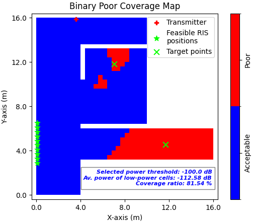

Showing and Exporting Phase Profiles
####################################

This section explains how to visualize the assigned RIS phase profiles for each RIS target point as well as the overall reflection coefficient phase profile and export them as .json file.

.. note::

   Before executing this step, you must first compute and visualize the **transmitter-only coverage map**.  
   Please follow the `Computing Transmitter-Only Coverage Map` tutorial beforehand.

There are two ways to define the RIS target points:

1. **Using the Target Points from Clustering**

.. note::

   To use this option, you must first run the clustering algorithm to compute target points.  
   Refer to the `Finding RIS Target Points via K-means Clustering` tutorial before proceeding.

In the GUI, select the radio button **"Use the target point(s) found via clustering algorithm"**. This will use the previously computed RIS target points to determine feasible RIS positions.

2. **Manually Entering Target Point Coordinates**

- Go to the labelframe **"Manual trials"** on the left side of the GUI.
- In the field **"Number of target points"**, enter how many target points you want to specify.
- Select the checkbox **"Enter the target point(s) manually"**.
- A new input area will appear at the bottom of the same labelframe.
- Enter the **x, y, z coordinates** for each target point manually.

After that, the RIS center position, RIS height and RIS width are entered under the labelframe **"Enter RIS center position (m) (x,y,z)"**, **"RIS height (m)"** and **"RIS width (m)"**, respectively. To see which RIS positions are feasible within the scene, please follow `Computing Feasible RIS Positions` tutorial. Then, choose the phase profile approach that will be followed for RIS phase profile configuration next to the textlabel **"Choose phase profile approach"**. In the case of choosing **"Manual entry"**, which means importing the phase profiles from a .json file, a new menu appears at the bottom of the GUI with the labelframe **"Select manual phase profile file (.json)"**. Click the button **"Browse"** to select the related phase profile .json file. For the other phase profile approaches, choosing only the phase profile is enough. Then, press the button **"Show and export phase profiles"**. After execution, the phase profiles for each RIS target point as well as the overall reflection coefficient phase profile are visualized and the results are exported as a .json file **"phase_profiles.json"** and **"overall_reflection_coefficient.json"**, respectively. An example scenario and the phase profile results are shown below:

   **Fig. 1**: Binary poor coverage map showing RIS target points (green 'X') and feasible RIS positions (green stars).
