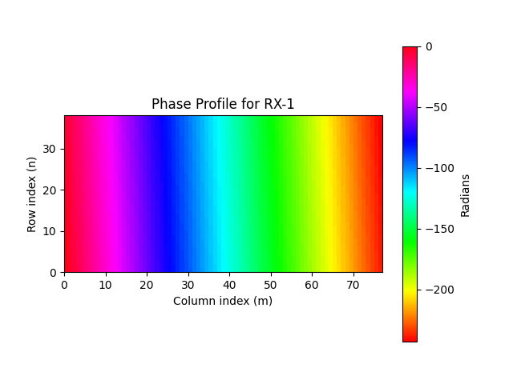
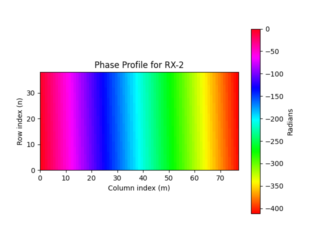
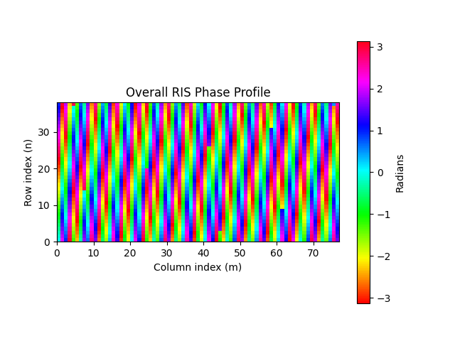

Showing and Exporting Phase Profiles
####################################

This tutorial explains how to visualize the assigned RIS phase profiles for each RIS target point, display the overall reflection coefficient phase profile, and export them as `.json` files.

.. note::

   Before executing this step, you must first compute and visualize the transmitter-only coverage map.  
   Please follow the `Computing Transmitter-Only Coverage Map` tutorial beforehand.

1. **Define RIS Target Points**

   There are two ways to define the RIS target points:

   - **Using the Target Points from Clustering**:

      .. note::

         To use this option, you must first run the clustering algorithm to compute target points.  
         Refer to the `Finding RIS Target Points via K-means Clustering` tutorial before proceeding.

      In the GUI, select the radio button **"Use the target point(s) found via clustering algorithm"**.

   - **Manually Entering Target Point Coordinates**:

      - Go to the labelframe **"Manual trials"** on the left side of the GUI.
      - Enter the number of RIS target points in the field **"Number of target points"**
      - Select the checkbox **"Enter the target point(s) manually"**.
      - A new input area will appear at the bottom of the same labelframe.
      - Enter the x, y, z coordinates for each target point manually.

2. **Enter RIS Parameters**

   - Set the RIS center position under the labelframe **"Enter RIS center position (m) (x,y,z)"**.
   - Set the RIS height and width under **"RIS height (m)"** and **"RIS width (m)"**, respectively.

   .. note::

      To determine feasible RIS positions in the scene, refer to the `Computing Feasible RIS Positions` tutorial.

3. **Choose Phase Profile Approach**

   - Select the desired phase profile approach from the dropdown next to the textlabel **"Choose phase profile approach"**.
   - If **"Manual entry"** is selected:

      - A new menu appears near the menu with the labelframe **"Select manual phase profile file (.json)"**.
      - Click the **"Browse"** button to select the phase profile `.json` file.

4. **Show and Export Phase Profiles**

   - Press the button **"Show and export phase profiles"**.
   - After execution:

      - The phase profiles for each RIS target point are visualized in both 3D and 2D formats.
      - The overall reflection coefficient phase profile is also displayed.
      - The results are exported into two `.json` files: *phase_profiles.json* (individual target point phase profiles) and *overall_reflection_coefficient.json* (overall phase profile)

An example scenario consisting of two RIS target points is shown below:

   **Fig. 1**: Phase profile for RX-1 with 3D visualization

   **Fig. 2**: Phase profile for RX-1 with 2D visualization

.. figure:: showing_and_exporting_phase_profile_Fig3.png
   :align: center
   :figwidth: 80%
   :name: showing_and_exporting_phase_profile_Fig3

   **Fig. 3**: Phase profile for RX-2 with 3D visualization

   **Fig. 4**: Phase profile for RX-2 with 2D visualization

   **Fig. 5**: Overall phase profile with 2D visualization
